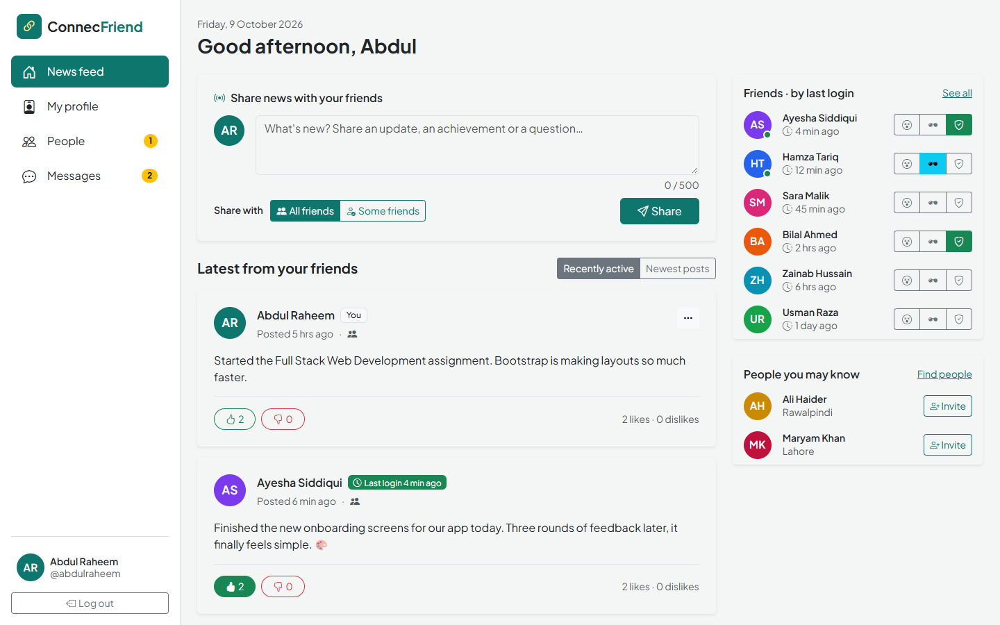
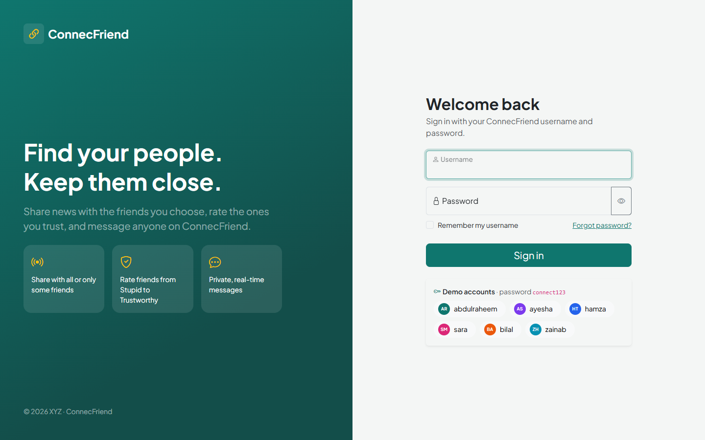
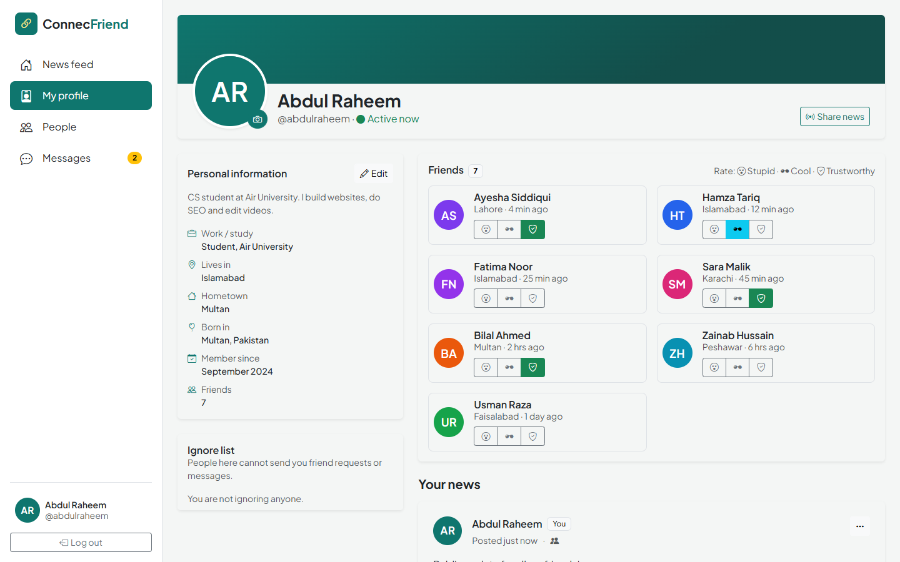
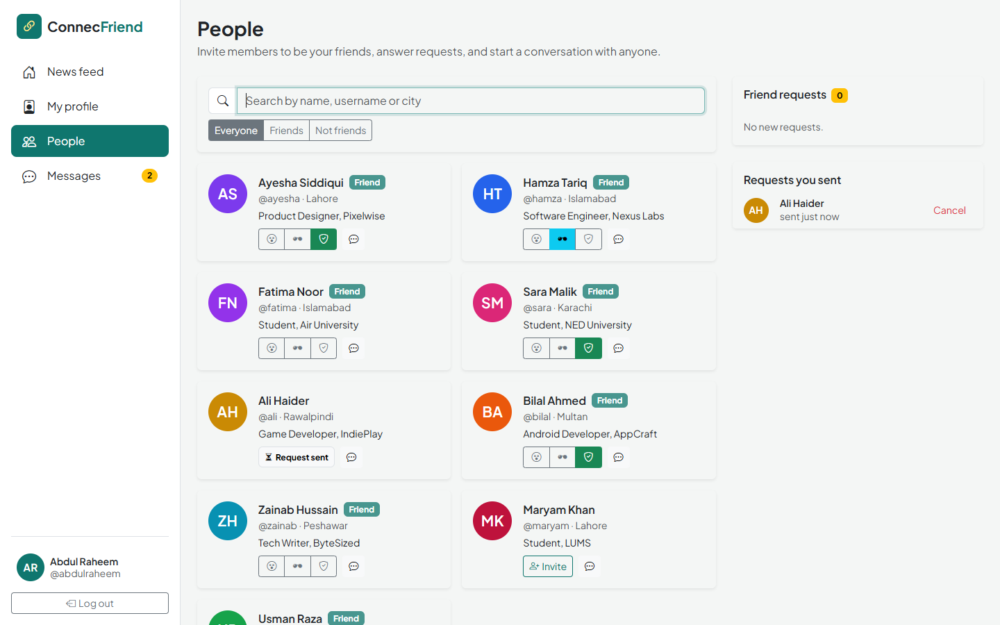
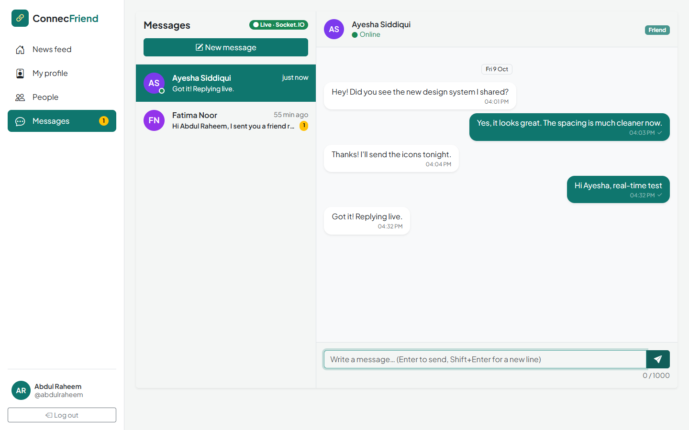
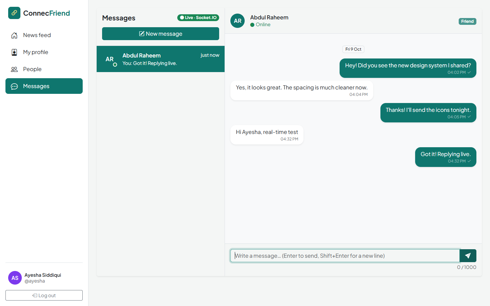
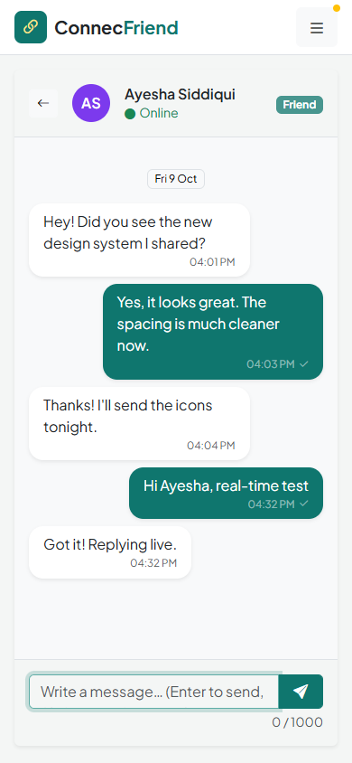

# ConnecFriend — Assignment 1 (Full Stack Web Development, CS 301)

**Student:** Abdul Raheem · BSCS-V-A (Shift-I) · Air University, Islamabad · CLO-1 GA-2

ConnecFriend is the user interface of a social networking site designed for the firm XYZ. It is built with
**Bootstrap 5.3**, Bootstrap Icons and plain JavaScript. Custom CSS is limited to what Bootstrap cannot do,
such as brand colours, the fixed sidebar width and chat layout heights. The design is original and does not
copy any existing social media platform.

**Live preview (no chat server):** [raheemxghumman.github.io/FULL-STACK-LAB/Assignment 1/public](https://raheemxghumman.github.io/FULL-STACK-LAB/Assignment%201/public/)



## Running it

**Without a server.** Open `public/index.html` in a browser. As the brief says there are no server calls, the
app keeps its data in the browser (`localStorage`) and a small data layer (`js/store.js`) imitates requests
and responses with short delays and error responses.

**With live chat (Socket.IO).** Install Node.js, then run:

```
npm install
npm start
```

Open http://localhost:3000. To chat between two people, open a second browser window in incognito or private
mode, or use a different browser, and log in as another member. Messages, typing indicators and online status
then travel through the socket server in real time.

| Demo usernames | Password |
|---|---|
| `abdulraheem`, `ayesha`, `hamza`, `sara`, `bilal`, `zainab`, `usman`, `fatima`, `ali`, `maryam` | `connect123` |

## Features and where they are

| Brief requirement | Implementation |
|---|---|
| **Login** with username and password (no registration) | `index.html`, `js/login.js`. Field-level errors for an empty username, an unknown username and a wrong password. Show or hide password, remember username, and demo account chips. Pages redirect to login when nobody is signed in. |
| **Profile page** with personal information, profile picture and all friends | `profile.html`, `js/profile.js`. Shows personal info (work, city, hometown, birthplace, member since), the profile picture, which you can upload as PNG/JPG/GIF/WEBP up to 1.5 MB, editable info in a modal, the friends list, and your news. `?id=` opens any member's profile. |
| **Home page** news feed, with friends shown in order of their login, latest first | `home.html`, `js/home.js`. Logging in updates your last-login time. The feed is ordered by each friend's last login, with a "Newest posts" option. A side panel lists friends by last login. |
| News shows the **news, friend's name, profile picture and time since last login** | Post card in `js/posts.js`. |
| **Invite friends**, refused if the other person has the sender on their **ignore list** | `people.html`, `js/people.js`, plus the invite buttons on profiles and the home page. Requests can be accepted, declined or cancelled. Maryam has Abdul Raheem on her ignore list, so inviting her shows *"Friend request not sent. Maryam Khan has added you to their ignore list."* You can manage your own ignore list on your profile. |
| **Rate friends 1–3**: Stupid, Cool, Trustworthy, shown as icons | Icon buttons (`bi-emoji-dizzy`, `bi-sunglasses`, `bi-shield-check`) on the home page, profile and People page. Only friends can be rated. |
| **Share news** with **all friends or only some** | Composer on the home page with "All friends" or "Some friends" and a friend picker. A post shared with some friends is only visible to them, and the lock icon shows who it was shared with. |
| **Like or dislike** with **counts** | Like and dislike buttons with live counts. Switching moves your vote, and clicking again removes it. |
| **Private messaging** with friends **and other members** | `messages.html`, `js/messages.js`, `js/chat.js`. Conversations list with unread badges, plus "New message" to any member. Live delivery, typing indicator and online status over Socket.IO (`server.js`). Messages to offline members are queued and delivered when they connect. Without the server, messages still reach other tabs of the same browser. |
| **Error handling** | Every action goes through `Store`, which throws `AppError` with a clear message. These are shown under the field, as an alert, or as a toast. Unexpected errors are caught by a global handler. Examples: empty post, post over 500 characters, no friend picked, duplicate invite, inviting yourself, rating a non-friend, oversized picture, empty or too-long message, messaging someone who ignores you. |

## Project structure

```
Assignment 1/
├── public/                  the web application
│   ├── index.html           login
│   ├── home.html            news feed, share news, friends by last login
│   ├── profile.html         profile, friends, ratings, ignore list
│   ├── people.html          member directory, invitations, requests
│   ├── messages.html        private messaging
│   ├── css/style.css        small custom layer on top of Bootstrap
│   └── js/
│       ├── data.js          seed data (the "database")
│       ├── store.js         data layer that imitates server requests
│       ├── ui.js            shared UI: sidebar, avatars, toasts, ratings, guard
│       ├── posts.js         news post card (feed + profile)
│       ├── chat.js          Socket.IO / BroadcastChannel message transport
│       └── login.js · home.js · profile.js · people.js · messages.js
├── server.js                Express + Socket.IO chat server
├── test/socket.test.js      automated test of the chat server (npm test)
└── package.json
```

## Testing

- `npm test` runs 9 checks of the chat server:
  - presence when members join and leave
  - real-time delivery
  - typing indicator
  - rejecting forged, empty or too-long messages
  - queued delivery to offline members
- 46 end-to-end checks were run in Chrome across every page:
  - login errors and the page guard
  - feed order
  - sharing with all or selected friends
  - like and dislike counts
  - ratings
  - an invite blocked by the ignore list, plus sending, accepting and searching
  - profile editing and validation
  - a two-person live chat over Socket.IO, with typing, a queued message to an offline member, and refusal by a member who ignores you
  - no horizontal scrolling on phones
  - no JavaScript errors

## Screenshots

| Login | Profile | People |
|---|---|---|
|  |  |  |

| Live chat (Abdul Raheem) | Live chat (Ayesha, second browser) | Mobile |
|---|---|---|
|  |  |  |
