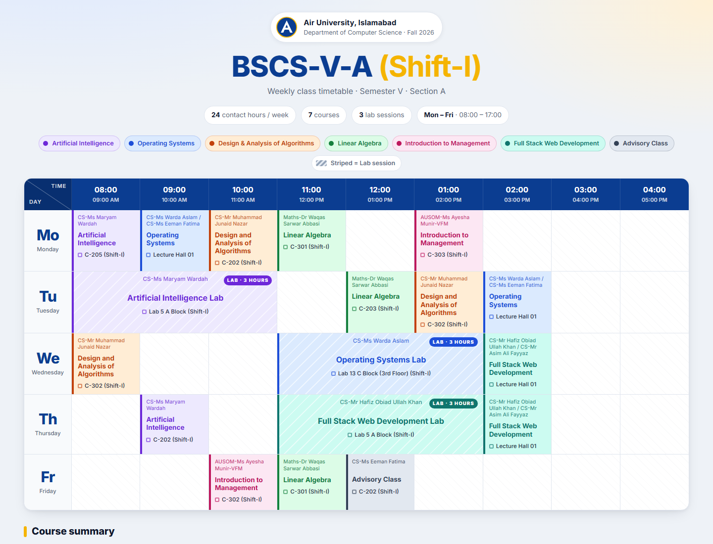
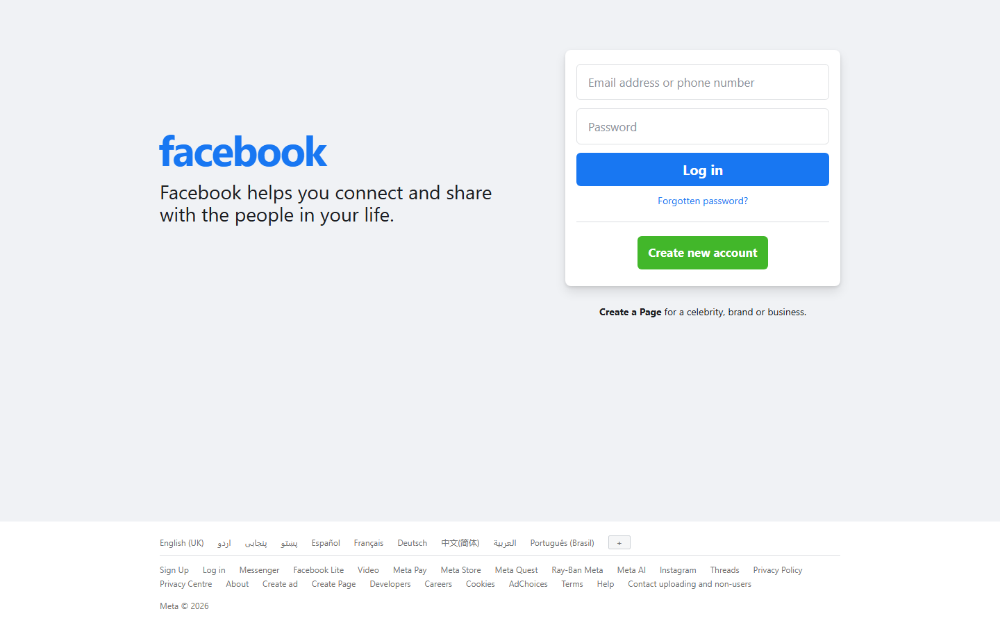
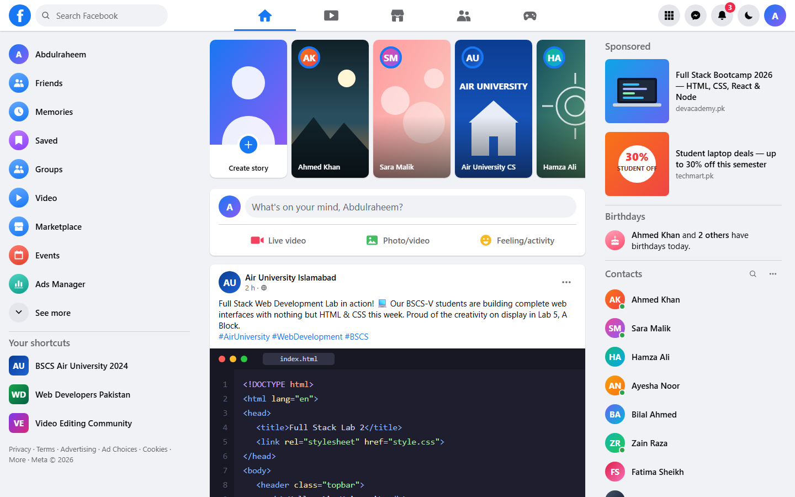
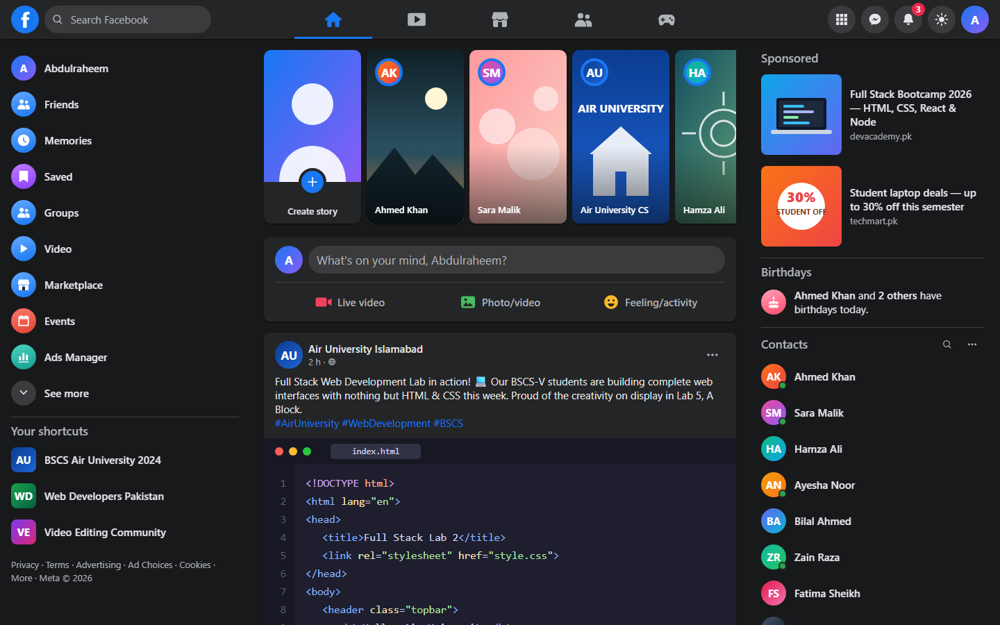
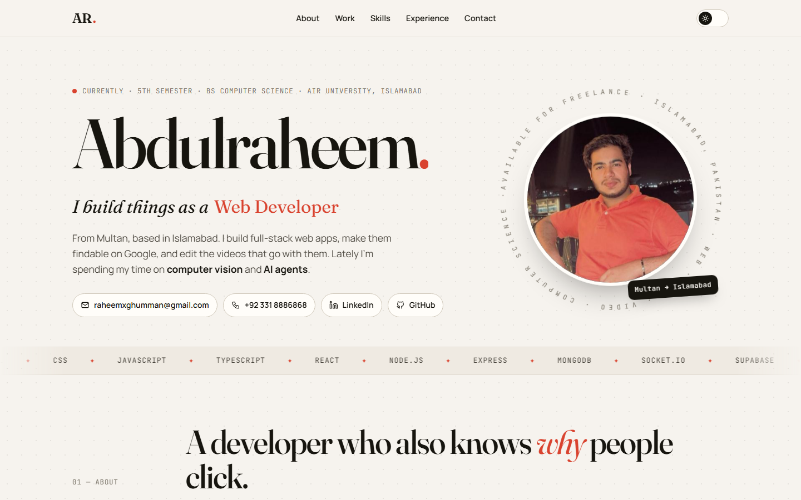
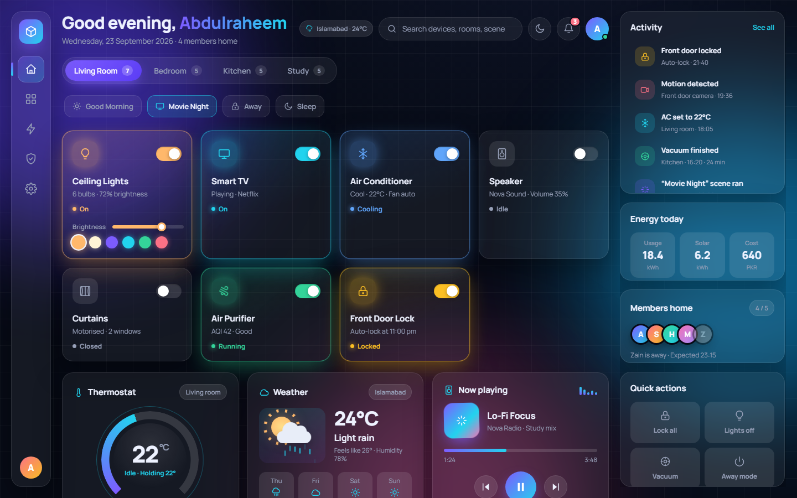
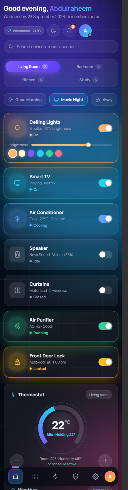
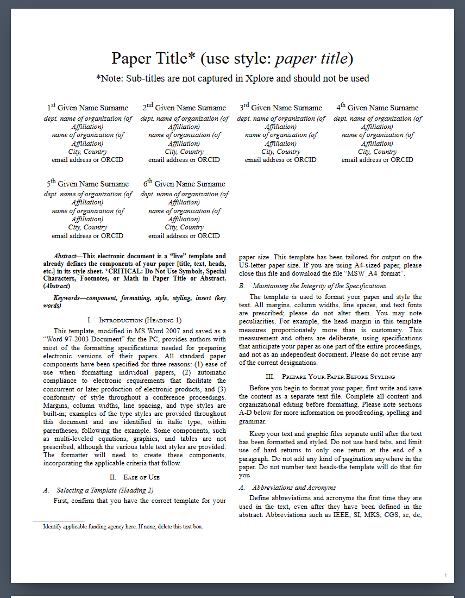

# Full Stack Web Development — Lab 2

**Student:** Abdulraheem · **Class:** BSCS-V-A (Shift-I) · **Air University, Islamabad**

Five front-end tasks built with **pure HTML5 + CSS3 only** — no JavaScript, no frameworks, no external
images or icon fonts. Every icon is hand-written inline SVG and every illustration is CSS or SVG, so each
page works fully offline. All interactivity (tabs, toggles, dark mode, menus) is done with CSS alone
(`:hover`, `:checked`, `:has()`, `:focus-within`, counters, animations).

| # | Task | Source | Live preview |
|---|------|--------|--------------|
| 1 | Class Timetable — BSCS-V-A (Shift-I) | [`Task-1-Timetable/`](Task-1-Timetable/) | [Open](https://raheemxghumman.github.io/FULL-STACK-LAB/Lab%202/Task-1-Timetable/) |
| 2 | Facebook Home Page (login + news feed) | [`Task-2-Facebook/`](Task-2-Facebook/) | [Login page](https://raheemxghumman.github.io/FULL-STACK-LAB/Lab%202/Task-2-Facebook/) · [News feed](https://raheemxghumman.github.io/FULL-STACK-LAB/Lab%202/Task-2-Facebook/home.html) |
| 3 | Personal Portfolio | [`Task-3-Portfolio/`](Task-3-Portfolio/) | [Open](https://raheemxghumman.github.io/FULL-STACK-LAB/Lab%202/Task-3-Portfolio/) |
| 4 | Custom UI — "Nova Home" Smart Home Control Panel | [`Task-4-Custom-UI/`](Task-4-Custom-UI/) | [Open](https://raheemxghumman.github.io/FULL-STACK-LAB/Lab%202/Task-4-Custom-UI/) |
| 5 | IEEE Conference Paper Template | [`Task-5-IEEE-Paper/`](Task-5-IEEE-Paper/) | [Open](https://raheemxghumman.github.io/FULL-STACK-LAB/Lab%202/Task-5-IEEE-Paper/) |

To run locally, open any task's `index.html` in a browser — nothing to install.

---

## Task 1 — Class Timetable

A clean recreation of the official aSc timetable sheet for **BSCS-V-A (Shift-I)**, kept deliberately close to the original:

- Same structure as the sheet: title, "Air University" label, time-slot header with both label styles, large day abbreviations, and the generated-on footer.
- Semantic `<table>` with `colspan="3"` for the three-hour lab blocks (AI Lab, OS Lab, Full Stack Lab); instructor, course and room in every cell.
- Small improvements only: consistent typography, a faint shade on lab cells, a hover highlight, horizontal scrolling with a sticky day column on phones, and a print stylesheet for one landscape page.

CSS concepts: `border-collapse`, `table-layout: fixed`, `position: sticky`, media queries, `@media print`, transitions.

## Task 2 — Facebook Home Page

| Login page | News feed | Dark mode |
|---|---|---|
|  |  |  |

Two pages that mirror the real facebook.com design:

- **`index.html`** — the logged-out landing page: wordmark, tagline, login card, "Create new account", language and links footer. The **Log in** button opens the feed.
- **`home.html`** — the logged-in News Feed: fixed top bar (search, five nav tabs, menu / Messenger / notifications badge, avatar), left sidebar with shortcuts, stories row, "What's on your mind" composer, posts with reactions, comments and Like / Comment / Share, reels row, and the right sidebar (sponsored, birthdays, contacts with online dots, group chats).
- **Dark mode** toggle (moon icon) implemented with a hidden checkbox and `body:has(:checked)` swapping CSS variables.
- Sticky, independently scrolling sidebars; hover states everywhere; breakpoints at 1260 / 900 / 600 px down to a phone layout.
- All icons are one inline SVG sprite; post images are hand-drawn SVG scenes; avatars are CSS gradients.

## Task 3 — Portfolio

Single-page portfolio for Abdulraheem (BS Computer Science, Air University Islamabad; born in Multan), designed as an editorial personal site rather than a template:

- Warm paper palette with one accent colour and a warm dark mode (checkbox + `:has()`); serif display type (Fraunces) with Manrope body text and JetBrains Mono labels.
- Hero: the name rises in letter by letter, a rotating role line, the real photo inside a continuously rotating text ring (SVG `textPath`), a tools ticker, and direct email, phone, LinkedIn and GitHub links.
- Sections: About, Work (six featured project cards with SVG mockups plus a compact list), Skills as grouped tag clouds, Experience and Education timelines with a scroll-drawn line, and Contact with a large email link and an HTML-only form.
- Motion done in CSS only: staggered reveals, `animation-timeline: scroll()` progress bar and `view()` section reveals with visible fallbacks, `@property` count-up numbers, tilt/zoom hovers, `prefers-reduced-motion` support. CSS-only hamburger menu on phones.
- Projects link to real GitHub repositories (Notes by Raheem, Real-time Chat App, CIRO, Insta Downloader, Amaan Hope Clinic, EduConnect, Prompt Formatter, this lab) with private work (NexaLAN, PostPilot, dv-downloader API) listed without links.

## Task 4 — Custom UI: "Nova Home" Smart Home Control Panel

| Desktop | Phone |
|---|---|
|  |  |

A fully interactive smart-home dashboard with **zero JavaScript**:

- Room tabs and scene chips (radio inputs + `:has()`), 22 iOS-style toggle switches — a switched-on card glows in its own accent colour, its icon lights up and its status text changes; fans and purifiers spin only while on.
- Ceiling-light colour picker that re-tints the card through a `--light-color` custom property.
- Thermostat dial drawn with `conic-gradient` and an animated registered `@property`, working +/− controls (hidden radios 18–26 °C).
- Pure-CSS 7-day energy bar chart with grow-in animation and hover tooltips; weather widget with rotating sun, drifting cloud and falling rain; music player with play/pause icon swap, progress bar and equalizer; 3D flip security-camera card with scanline and blinking REC.
- Light-mode toggle, container queries for the device cards, scroll-snap scenes row, `clamp()` typography, glassmorphism with `backdrop-filter`, `prefers-reduced-motion`, focus-visible rings.
- Responsive: three-column shell at desktop, right panel stacks at tablet, sidebar becomes a bottom tab bar on phones.

## Task 5 — IEEE Conference Paper Template

A pixel-accurate HTML/CSS reproduction of the instructor's `conference-template-letter.docx`, using the measurements read from the Word file:

- US Letter sheets (8.5 × 11 in) with 0.75 in top, 1 in bottom and 0.62 in side margins, two 3.5 in columns with a 0.25 in gutter, Times New Roman throughout.
- 24 pt title, 11 pt author names in the four-per-row author grid, 9 pt bold abstract and keywords, 10 pt justified body text, 8 pt captions and references, 6 pt table footnote.
- Headings numbered with **CSS counters**: small-caps centred Heading 1 (I., II., …), italic Heading 2 (A., B., …), italic run-in Heading 3 (1), 2)), unnumbered Heading 5 for Acknowledgment and References.
- Bullet lists, a numbered equation with the number flush right, TABLE I with caption above and lettered footnote, Fig. 1 with caption below, the first-page funding-agency footnote, and a bracketed reference list with hanging indents.
- Content is paginated by hand into four fixed-size pages exactly where Word breaks it, so **Ctrl + P** prints or saves a true Letter-size PDF (`@page` rules remove the on-screen chrome).
- On small screens the sheets scale down so the whole page stays readable.
