# Full Stack Web Development — Lab 3

**Student:** Abdulraheem · **Class:** BSCS-V-A (Shift-I) · **Air University, Islamabad** · CLO-1 GA-4

Lab 3 has two tasks, both built with **Bootstrap 5.3**:

1. **Modify all tasks of Lab 2 and implement them using Bootstrap** — [`Task-1-Bootstrap-Versions/`](Task-1-Bootstrap-Versions/)
2. **Build an e-commerce store using Bootstrap** — [`Task-2-Ecommerce-Store/`](Task-2-Ecommerce-Store/)

The original Lab 2 work is kept unchanged in [`../Lab 2`](../Lab%202/) for its own grading.

Bootstrap and Bootstrap Icons load from the jsDelivr CDN, so an internet connection is needed to view the pages.
To run locally, open any `index.html` in a browser; nothing to install.

---

## Task 1 — Lab 2 tasks rebuilt with Bootstrap

| # | Page | Source | Live preview |
|---|------|--------|--------------|
| 1 | Class Timetable | [`1-Timetable/`](Task-1-Bootstrap-Versions/1-Timetable/) | [Open](https://raheemxghumman.github.io/FULL-STACK-LAB/Lab%203/Task-1-Bootstrap-Versions/1-Timetable/) |
| 2 | Facebook Home Page | [`2-Facebook/`](Task-1-Bootstrap-Versions/2-Facebook/) | [Login](https://raheemxghumman.github.io/FULL-STACK-LAB/Lab%203/Task-1-Bootstrap-Versions/2-Facebook/) · [Feed](https://raheemxghumman.github.io/FULL-STACK-LAB/Lab%203/Task-1-Bootstrap-Versions/2-Facebook/home.html) |
| 3 | Portfolio | [`3-Portfolio/`](Task-1-Bootstrap-Versions/3-Portfolio/) | [Open](https://raheemxghumman.github.io/FULL-STACK-LAB/Lab%203/Task-1-Bootstrap-Versions/3-Portfolio/) |
| 4 | Custom UI — Nova Home | [`4-Custom-UI/`](Task-1-Bootstrap-Versions/4-Custom-UI/) | [Open](https://raheemxghumman.github.io/FULL-STACK-LAB/Lab%203/Task-1-Bootstrap-Versions/4-Custom-UI/) |
| 5 | IEEE Paper Template | [`5-IEEE-Paper/`](Task-1-Bootstrap-Versions/5-IEEE-Paper/) | [Open](https://raheemxghumman.github.io/FULL-STACK-LAB/Lab%203/Task-1-Bootstrap-Versions/5-IEEE-Paper/) |

### What Bootstrap does in each page

| Page | Bootstrap features used |
|------|-------------------------|
| **Timetable** | `.table .table-bordered .align-middle` in `.table-responsive`, `.table-light` header, `colspan` lab blocks with Bootstrap tertiary shading, card wrapper, grid header, **tooltips** on labs, Print button (`d-print-none`). Kept plain and close to the official aSc sheet. |
| **Facebook** | Login: grid, card, large form controls, **sign-up modal** (like the real site) with form **validation**. Feed: fixed **navbar** with input-group search, badges, avatar **dropdown**, dark mode via `data-bs-theme`, responsive grid with sticky sidebars, **list groups**, **cards**, per-post dropdowns, **collapse** for comments, Create post **modal**, **offcanvas** menu on small screens, **tooltips**, **toasts**, ratio helper. |
| **Portfolio** | Collapsing sticky navbar with **scrollspy**, dark/light toggle, grid hero with `rounded-circle` photo, pill buttons, project **cards** with a details **modal** each, **list group** of more projects, skill **badges**, **accordions** for experience and education, **floating-label form** with validation, **tooltips**, back-to-top. Same real content and editorial design as Lab 2. |
| **Nova Home** | `data-bs-theme="dark"`, **nav-pills tabs** for rooms, **form-switch** toggles on 22 device cards, **form-range** brightness, **btn-check** swatches and scenes, **dropdown** notifications, **progress** bars and a **table** for energy, camera **modal**, scene **toasts**, **offcanvas** activity panel, **tooltips**, sidebar that becomes a bottom nav on phones. |
| **IEEE Paper** | Dark **navbar** toolbar with Print / Save PDF, author block as a `.row .row-cols-4` grid, TABLE I as `.table .table-bordered .table-sm`, Fig. 1 with `.figure` / `.figure-caption`, flex and spacing utilities. The two-column body stays CSS multi-column (Bootstrap has no column-count), and IEEE typography is scoped so Bootstrap's reboot does not change it. Prints as four exact US-Letter pages. |

| Timetable | Facebook | Portfolio |
|---|---|---|
| 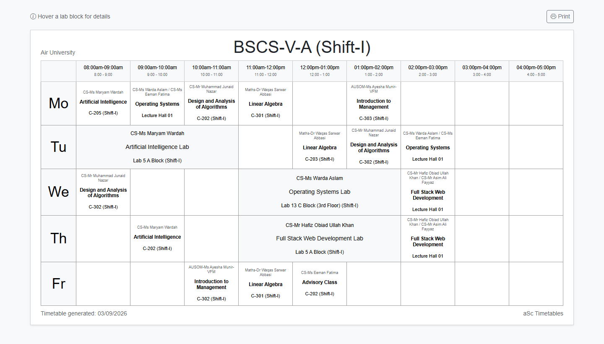 | 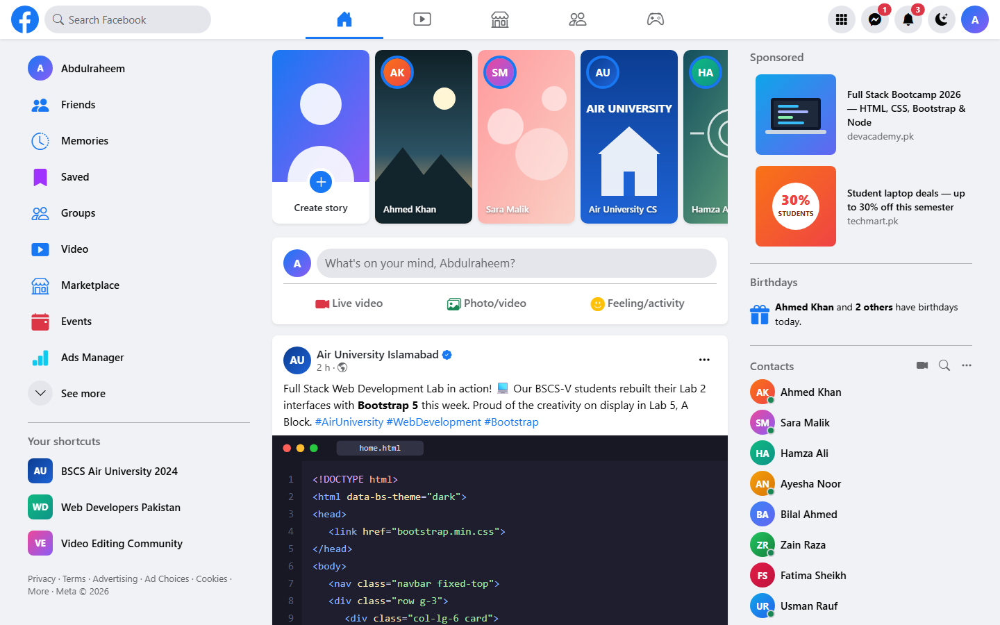 | 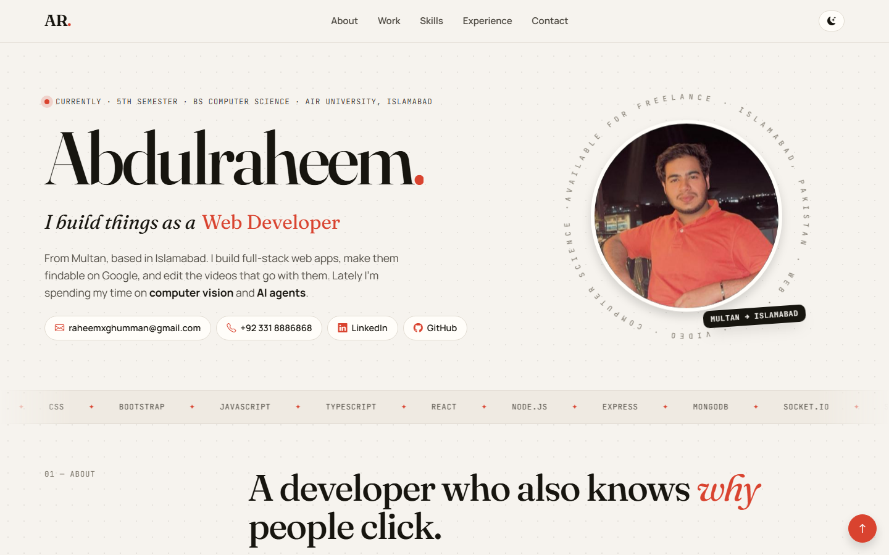 |

| Nova Home | IEEE Paper | Facebook sign-up modal |
|---|---|---|
| 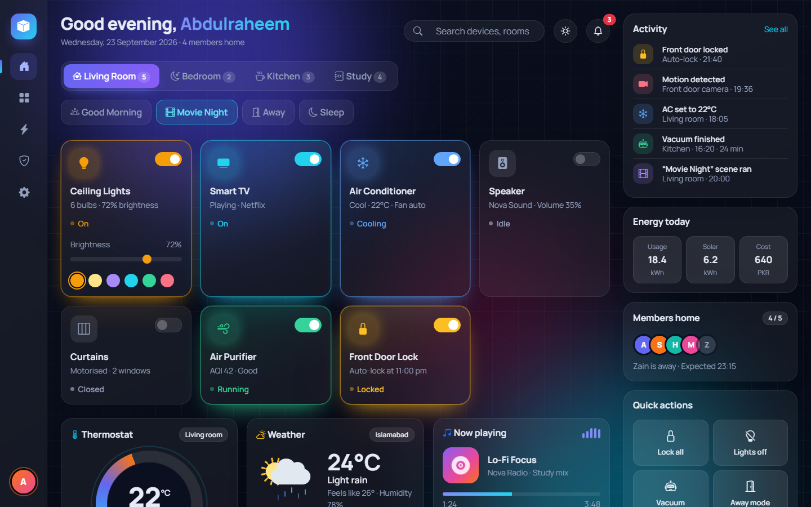 | 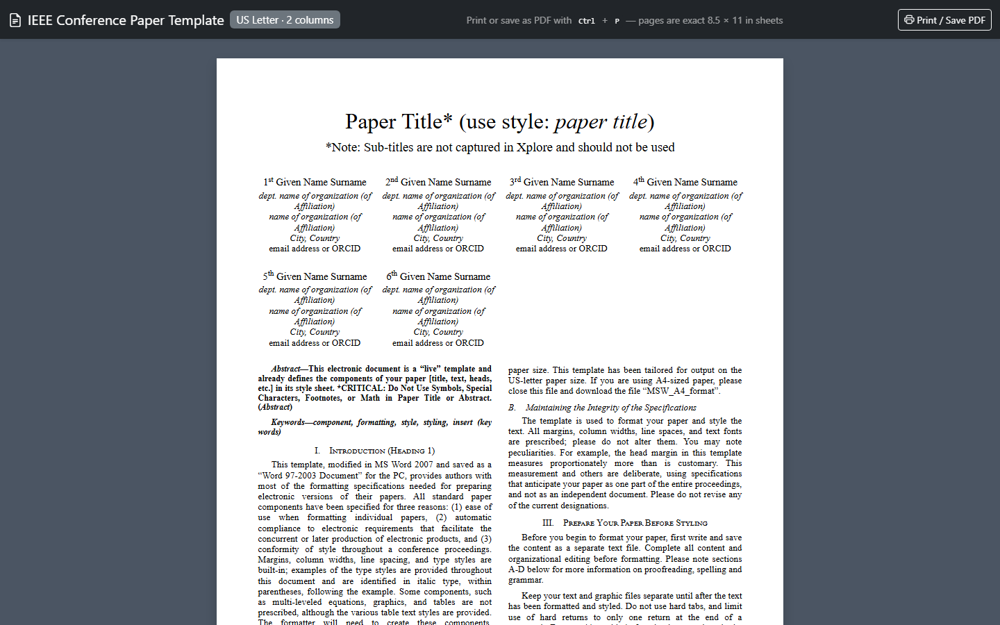 | 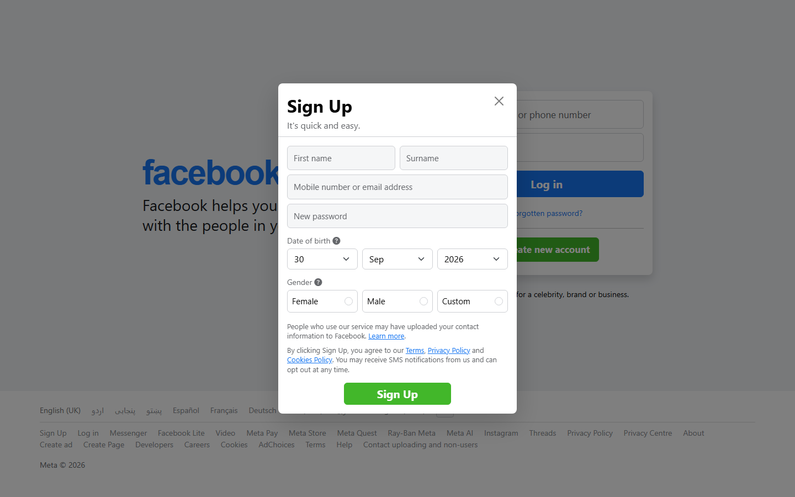 |

---

## Task 2 — E-commerce store: Kashi Ghar

**Live:** [raheemxghumman.github.io/FULL-STACK-LAB/Lab 3/Task-2-Ecommerce-Store](https://raheemxghumman.github.io/FULL-STACK-LAB/Lab%203/Task-2-Ecommerce-Store/)

**Kashi Ghar** is an online store for Multani blue pottery and handicrafts (surahi vases, matkas, serving bowls, kashi tiles, camel-skin lamps, khussa, ajrak), priced in PKR. It is built with Bootstrap 5.3 and plain JavaScript, with the cart, accounts, reviews and orders saved in the browser's `localStorage`. All product art is hand-drawn inline SVG.

**Demo account:** `demo@kashighar.pk` / `demo1234` · **Coupons:** `MULTAN10` (10% off), `KASHI500` (PKR 500 off orders over 3,000)

### Required features

| Feature | Where | How |
|---------|-------|-----|
| **Signup** | `signup.html`, `js/auth.js` | Bootstrap validation plus custom checks: +92 phone format, matching passwords, duplicate email, password strength meter. Password stored as a SHA-256 hash, then auto-login. |
| **Login** | `login.html`, `js/auth.js` | Show/hide password, remember me, error alert on wrong details, redirect back to the page in `?next=`. |
| **Navbar** | every page (`js/app.js`) | Sticky, collapses to a hamburger, live search, cart badge, Log in / Sign up or a "Hi, name" dropdown with My orders and Log out. |
| **Hero section** | `index.html` | Three-slide **carousel** with Shop buttons, plus feature badges (handmade, free delivery, COD, returns). |
| **Product listing** | `index.html`, `js/shop.js` | 12 products in a responsive card grid, category filter (btn-check group), sort select, search, star ratings, sale and low-stock badges, quick-view **modal**, empty state. |
| **Reviews** | `index.html`, product modal | Rating breakdown with **progress** bars, review cards, write-a-review form with star radios. New reviews save and update the product rating immediately. |
| **Add product to cart** | product cards and modal | Adds with quantity, respects stock, shows a **toast**, updates the badge. |
| **Display cart** | `cart.html`, mini-cart **offcanvas** | Table on desktop, cards on phones, order summary with subtotal, discount, delivery and total, free-delivery progress bar. |
| **Edit cart** | `cart.html`, mini-cart | +/− buttons, typed quantity checked against stock, remove with a confirm **modal**, clear cart, coupon codes. Everything recalculates live and persists. |
| **Checkout** | `checkout.html`, `js/checkout.js` | Requires login and a non-empty cart. Contact prefilled, shipping address with Pakistani cities, Standard or Express delivery, payment by Cash on Delivery, JazzCash / Easypaisa, or card (fields shown with **collapse**, card number and expiry validated). Placing the order saves it as `KG-2026-XXXX`, clears the cart and shows a success **modal**. |

`account.html` shows the profile and order history in an **accordion**.

This is a front-end demo: accounts and orders live only in the visitor's browser, and a real store would need a server and a payment gateway.

### Screenshots

| Home | Product quick view | Mini-cart |
|---|---|---|
| 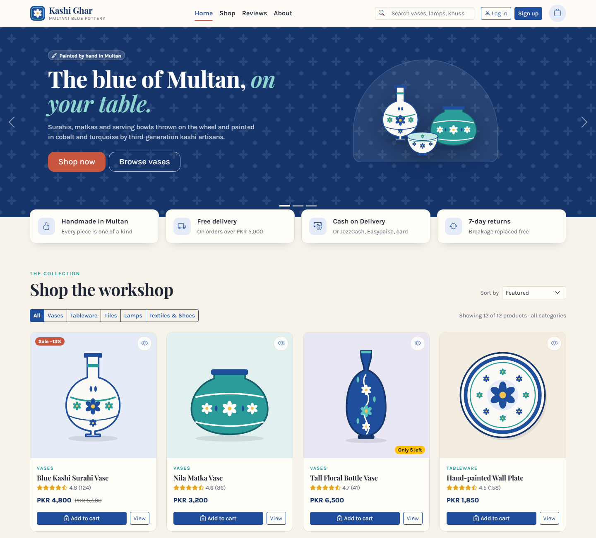 | 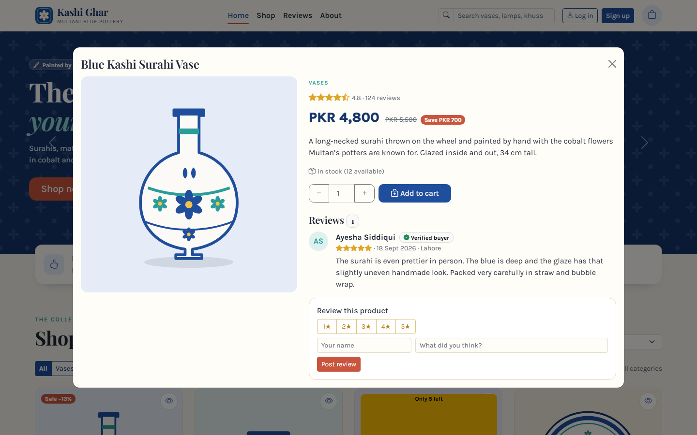 | 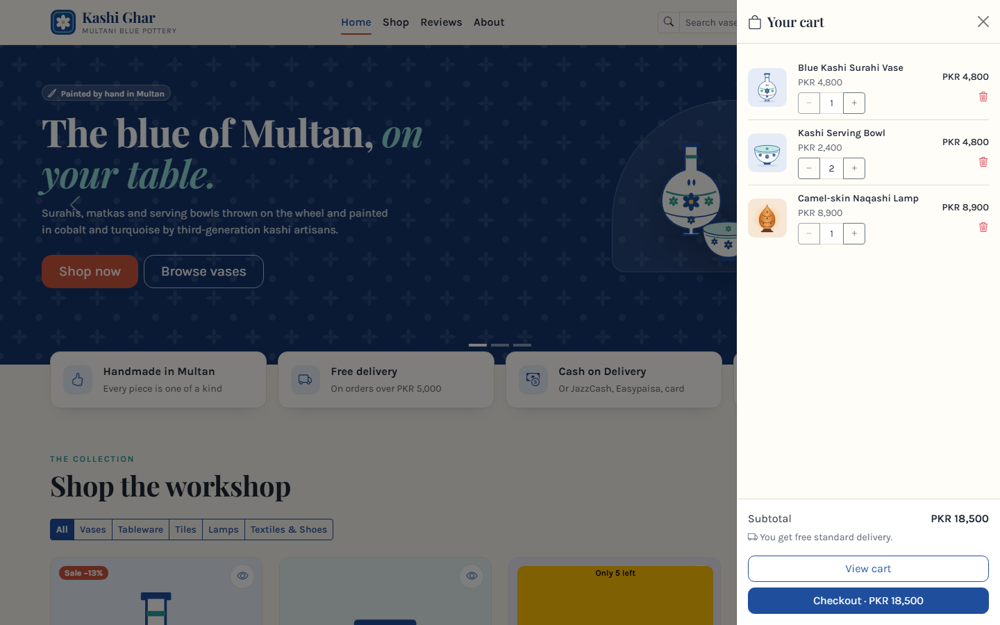 |

| Cart | Checkout | Orders |
|---|---|---|
| 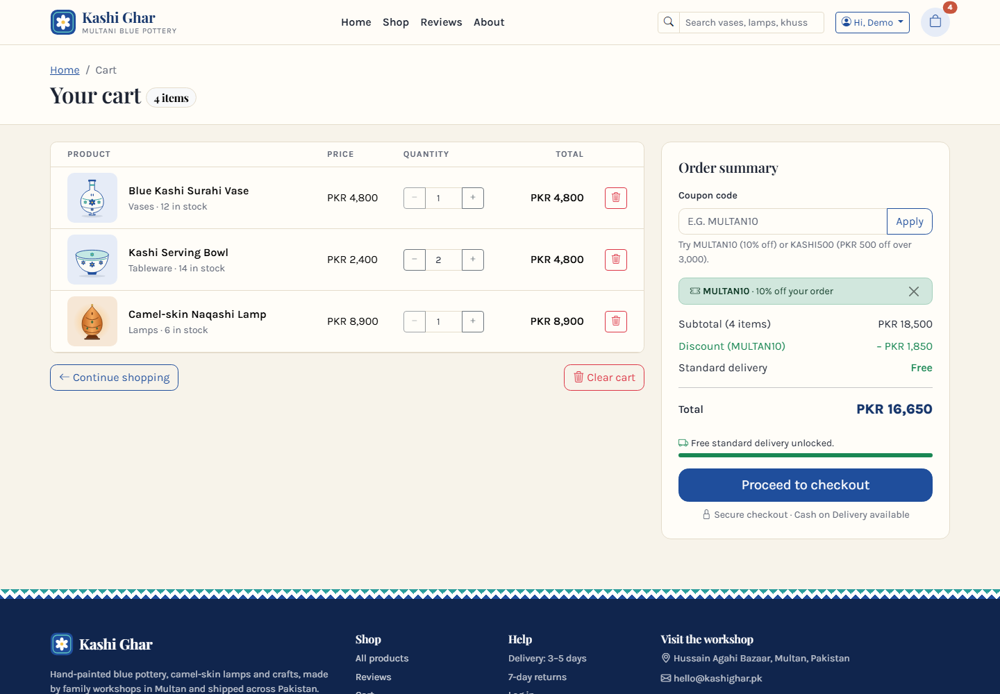 | 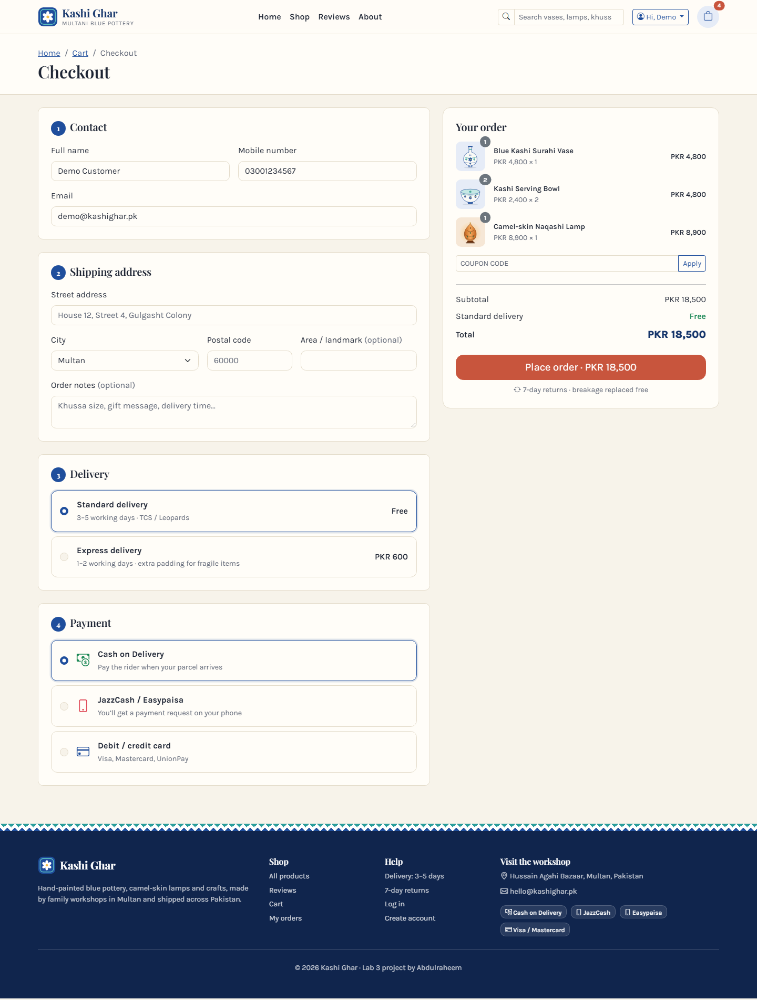 | 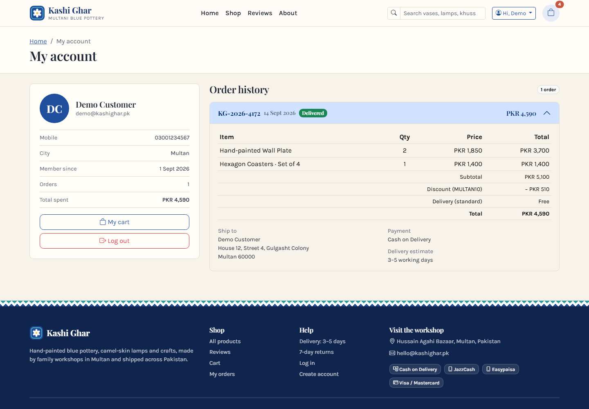 |

| Sign up | Log in | Phone |
|---|---|---|
| 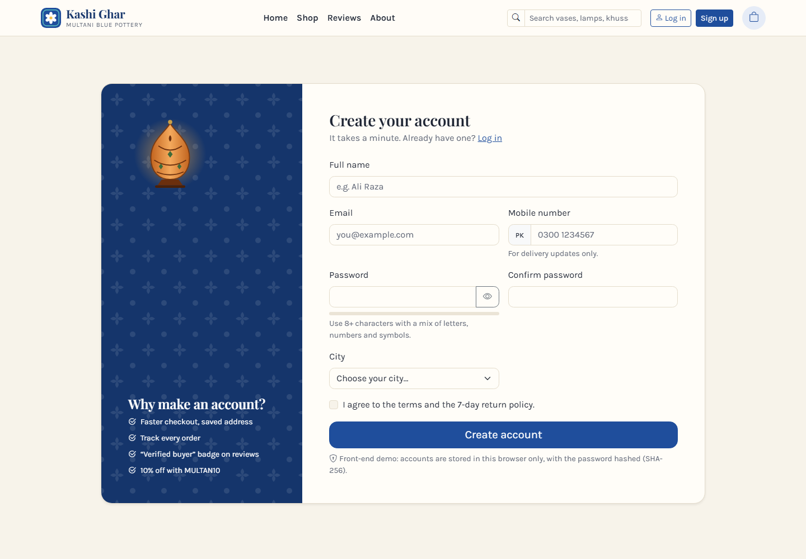 | 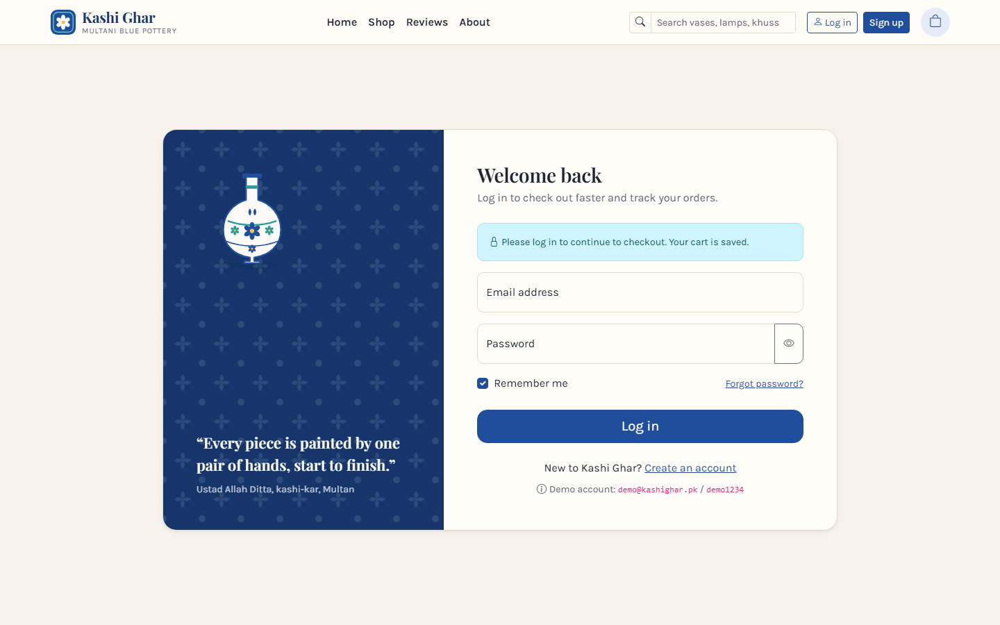 | 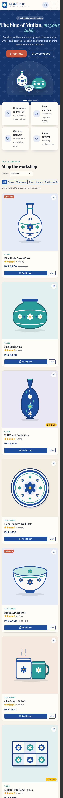 |

