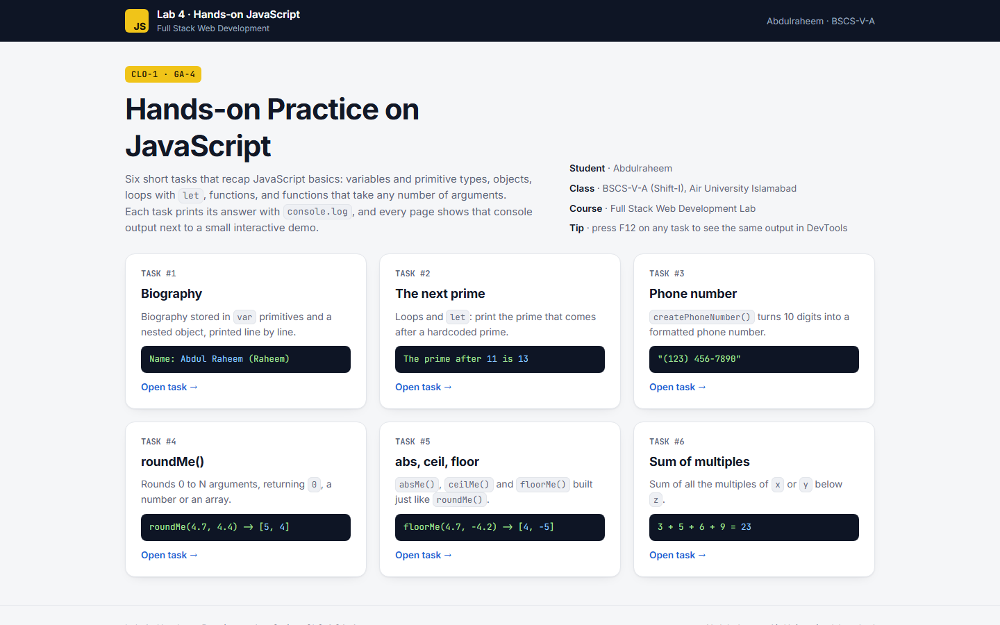
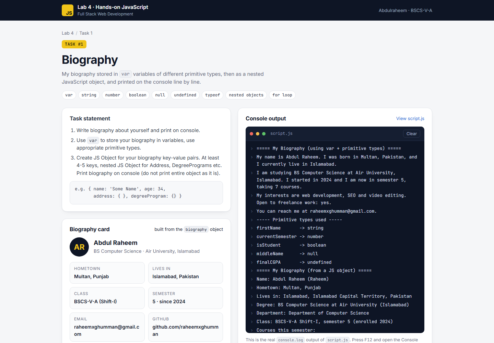
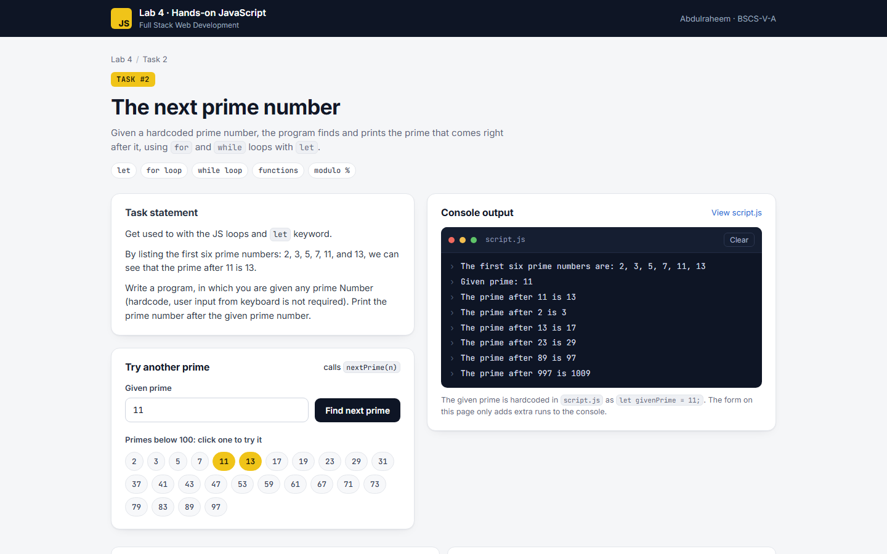
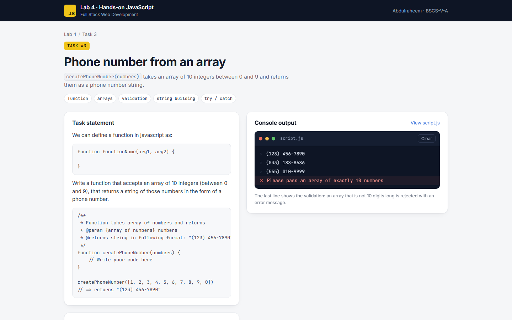
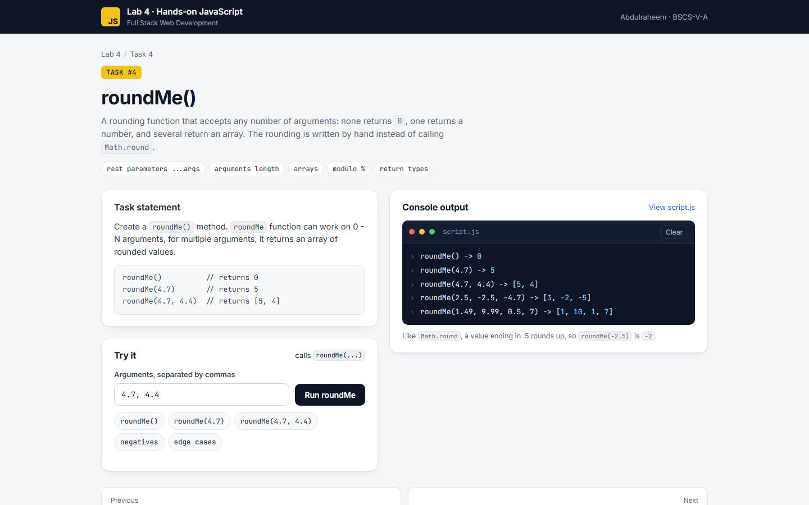
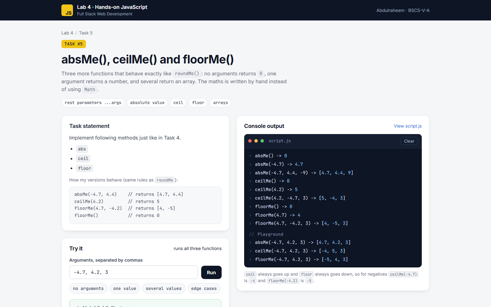
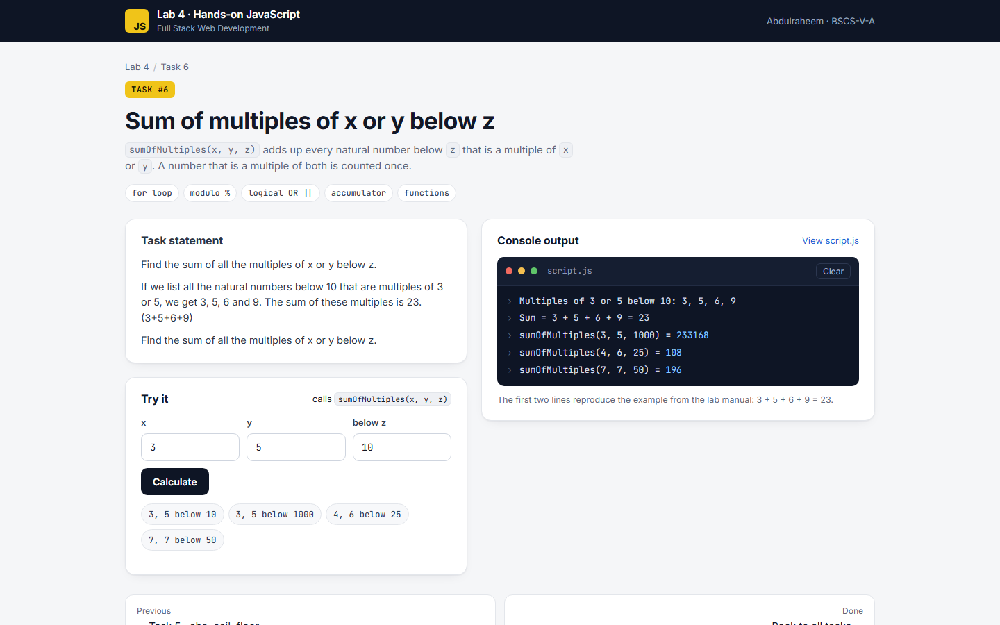

# Full Stack Web Development — Lab 4

## Hands-on Practice on JavaScript · CLO-1 GA-4

**Student:** Abdulraheem · **Class:** BSCS-V-A (Shift-I) · **Air University, Islamabad**

Six JavaScript tasks from the lab manual. Each task's answer is a plain JavaScript file (`script.js`)
that prints its results with `console.log`, exactly as the manual asks. Each task also has a page
(`index.html`) that shows the task statement, mirrors the same console output on screen, and adds a
small interactive demo.

**Live:** [raheemxghumman.github.io/FULL-STACK-LAB/Lab 4](https://raheemxghumman.github.io/FULL-STACK-LAB/Lab%204/)

To run locally, open `index.html` in a browser. To see the raw console output, open any task and
press **F12 → Console**. No installation is needed.



| # | Task | Answer | Page |
|---|------|--------|------|
| 1 | Biography with `var`, primitive types and a nested object | [`script.js`](Task-1-Biography/script.js) | [Open](https://raheemxghumman.github.io/FULL-STACK-LAB/Lab%204/Task-1-Biography/) |
| 2 | Print the prime after a given prime (loops and `let`) | [`script.js`](Task-2-Next-Prime/script.js) | [Open](https://raheemxghumman.github.io/FULL-STACK-LAB/Lab%204/Task-2-Next-Prime/) |
| 3 | `createPhoneNumber()` from an array of 10 digits | [`script.js`](Task-3-Phone-Number/script.js) | [Open](https://raheemxghumman.github.io/FULL-STACK-LAB/Lab%204/Task-3-Phone-Number/) |
| 4 | `roundMe()` for 0 to N arguments | [`script.js`](Task-4-roundMe/script.js) | [Open](https://raheemxghumman.github.io/FULL-STACK-LAB/Lab%204/Task-4-roundMe/) |
| 5 | `absMe()`, `ceilMe()`, `floorMe()` just like Task 4 | [`script.js`](Task-5-abs-ceil-floor/script.js) | [Open](https://raheemxghumman.github.io/FULL-STACK-LAB/Lab%204/Task-5-abs-ceil-floor/) |
| 6 | Sum of all the multiples of x or y below z | [`script.js`](Task-6-Sum-of-Multiples/script.js) | [Open](https://raheemxghumman.github.io/FULL-STACK-LAB/Lab%204/Task-6-Sum-of-Multiples/) |

---

### Task 1 — Biography

- **Part 1 and 2:** the biography is stored in `var` variables using the primitive types string, number, boolean, `null` and `undefined`, printed as sentences, followed by the `typeof` of each variable.
- **Part 3:** the same biography as an object with more than five keys and nested objects for `address`, `degreeProgram` and `contact`. It is printed field by field, with a `for` loop over the courses, and never as the whole object.

### Task 2 — The next prime

`isPrime(n)` tests divisors up to the square root with a `for` loop, and `nextPrime(prime)` counts upward with a `while` loop. Everything uses `let`. The given prime is hardcoded as `let givenPrime = 11;`, so the output is "The prime after 11 is 13". The script also lists the first six primes and a few more examples. Passing a number that is not prime raises an error.

### Task 3 — Phone number

`createPhoneNumber([1, 2, 3, 4, 5, 6, 7, 8, 9, 0])` returns `"(123) 456-7890"`. The function keeps the manual's JSDoc header and checks that the input is exactly 10 whole numbers between 0 and 9, reporting a clear error otherwise.

### Task 4 — roundMe()

`roundMe(...numbers)` returns `0` with no arguments, a number with one argument, and an array with several. The rounding is written by hand with `%` instead of `Math.round`, and follows the same rule: .5 rounds up, so `roundMe(-2.5)` is `-2`.

| Call | Result |
|------|--------|
| `roundMe()` | `0` |
| `roundMe(4.7)` | `5` |
| `roundMe(4.7, 4.4)` | `[5, 4]` |

### Task 5 — abs, ceil, floor

`absMe()`, `ceilMe()` and `floorMe()` follow the same 0 / 1 / N argument rules as `roundMe()`, also without using `Math`.

| Call | Result |
|------|--------|
| `absMe(-4.7, 4.4, -9)` | `[4.7, 4.4, 9]` |
| `ceilMe(4.2, -4.7, 3)` | `[5, -4, 3]` |
| `floorMe(4.7, -4.2, 3)` | `[4, -5, 3]` |

### Task 6 — Sum of multiples

`sumOfMultiples(x, y, z)` loops over 1 … z−1 and adds every number divisible by `x` or `y`, counting numbers like 15 only once. The manual's example gives `3 + 5 + 6 + 9 = 23`, and `sumOfMultiples(3, 5, 1000)` is `233168`.

---

### Testing

All answers were checked in a browser test page:

- Expected outputs for every example in the manual.
- `nextPrime` against a brute-force search for every prime below 5,000.
- `roundMe`, `absMe`, `ceilMe` and `floorMe` against `Math.round`, `Math.abs`, `Math.ceil` and `Math.floor` on more than 6,000 values, including negatives and exact .5 cases.
- Invalid input for Tasks 2, 3 and 6.
- The interactive demos on every page.

### Screenshots

| Task 1 | Task 2 | Task 3 |
|---|---|---|
|  |  |  |

| Task 4 | Task 5 | Task 6 |
|---|---|---|
|  |  |  |

### Folder structure

```
Lab 4/
├── index.html                 overview of all six tasks
├── assets/
│   ├── style.css              shared styles
│   └── console.js             shows console.log output on the page
├── Task-1-Biography/          index.html · script.js (answer) · ui.js (page demo)
├── Task-2-Next-Prime/
├── Task-3-Phone-Number/
├── Task-4-roundMe/
├── Task-5-abs-ceil-floor/
└── Task-6-Sum-of-Multiples/
```
